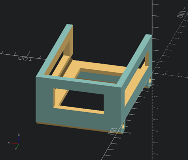
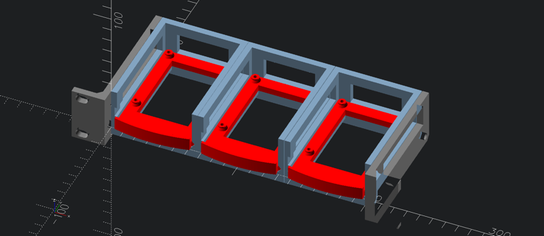

Raspberry Pi 4 1U 10-inch-rack-mount bracket
============================================

Summary
-------

For 10-inch "mini rack" 1U assembled tray to support three side-by-side Raspberry Pis.

Using [Raspberry Pi 4 1U 10-inch-rack-mount bracket](https://www.thingiverse.com/thing:5348000) as starting point

UPDATES
-------

**2025-Jun-23** : Initial STL import from thing:5348000 and .scad from thing:4125055

-	used a simple muckup.scad to import STLs for comparison in OpenSCAD.

-	my-raspberry-pi-rack-1u-frame-w67p0-bolt2p4-f0p25.stl

	-	Recreated a 10inch frame version. Mine using outer width of 67.0 mm to match theirs

Printing
--------

Print a left and a right ear

for each Pi (up to three)

-	print a frame `my-raspberry-pi-rack-1u-frame-w67p0-bolt2p4-f0p25.stl`
-	print a tray

### Possible tweaks

Drawings and renders
--------------------

Model Repositories
------------------

-	Printables: https://www.printables.com/model/645469-iphone-15-pro-max-mechanical-mockup

-	Thingiverse: [iPhone 15 Pro Max mockup mechanical dummy model](https://www.thingiverse.com/thing:6311478)

Acknowledgements
----------------

-	[Raspberry Pi 4 1U 10-inch-rack-mount bracket](https://www.thingiverse.com/thing:5348000) as starting point

-	[10" 1U Rackmount 3x Pi rack](https://www.thingiverse.com/thing:4299802)

-	[Raspberry Pi 4/5 1U rack-mount bracket](https://www.thingiverse.com/thing:4125055)
