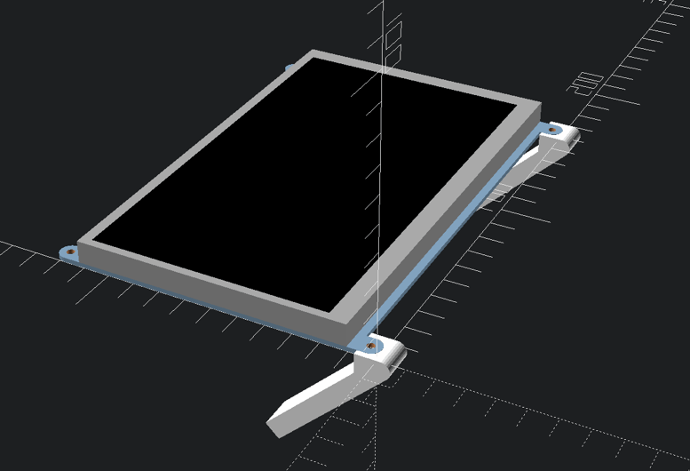
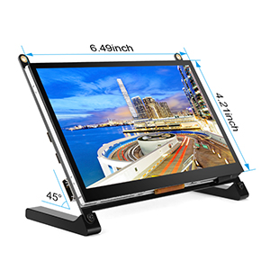

7-inch HDMI touchscreen Mockup
==============================

<!-- markdown-toc start - Don't edit this section. Run M-x markdown-toc-refresh-toc -->

**Table of Contents**

-	[Models involved](#models-involved)
	-	[HDMI display with its PCB (mechanical)](#hdmi-display-with-its-pcb-mechanical)
		-	[Product Details for 7-inch HDMI display touchscreen display](#product-details-for-7-inch-hdmi-display-touchscreen-display)

<!-- markdown-toc end -->

Models involved
===============

-	*HDMI display with its PCB (mechanical)*
	-	standalone model created in this project

HDMI display with its PCB (mechanical)
--------------------------------------

Touchscreen monitor model with included stand legs

### Product Details for 7-inch HDMI display touchscreen display

https://www.amazon.com/gp/product/B07L6WT77H/

Touchscreen Monitor, 7 Inch Portable USB Monitor Raspberry Pi Touch Screen IPS Display Computer Monitor 1024X600 16:9 HDMI Game Monitor for Pi 4/3 /2/ Zero/B Raspbian Ubuntu Xbox /PS4 Mac

Brand?: EVICIV

-	7 inch
-	IPS Panel
-	178-degree angle view
-	Milti-Point touch
-	3-5ms(Tr+Td)
-	Built-in speakers
