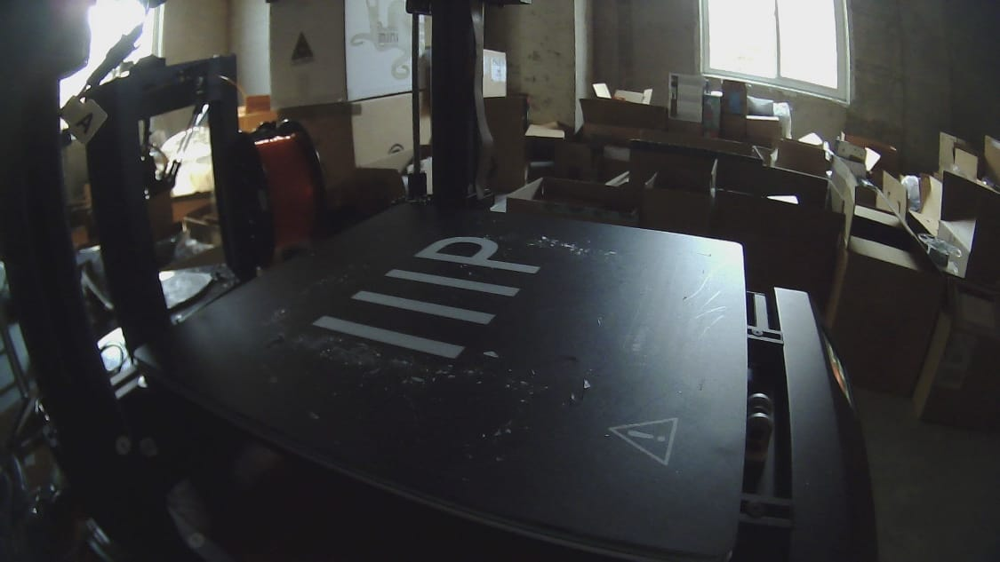
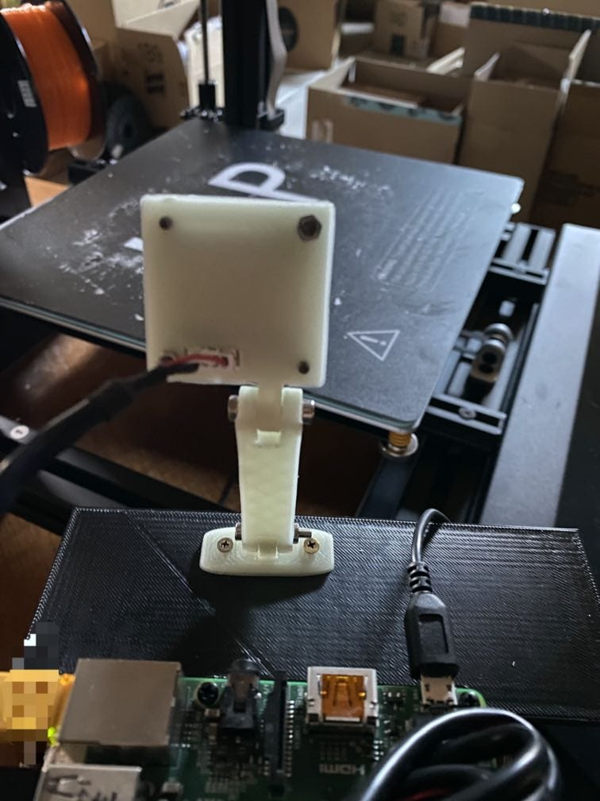
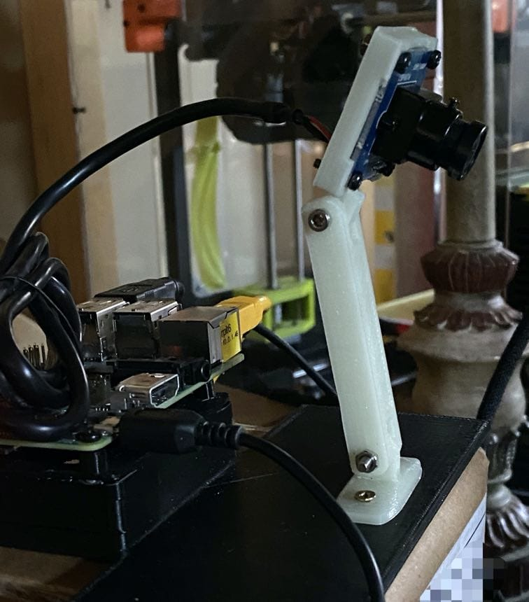

Stand Mount for ELP USB webcam ELP-USBFHD01M-L28
================================================

Stand Mount for ELP USB webcam `ELP-USBFHD01M-L28`

-	had already snapped off outer PCB strips, leaving the main PCB (32mmx32mm)
-	Assembled using machine screws and screwed/bolted into 3mm 3d printed plate.

The "plate" is the excellent [piPad - Raspberry Pi Prototyping Board](https://www.thingiverse.com/thing:725648)

thingiverse
-----------

-	[STAND MOUNT FOR ELP USB WEBCAM ELP-USBFHD01M-L28](https://www.thingiverse.com/thing:4077308)

### Related things

-	LulzBot Mini bed USB camera mount https://www.thingiverse.com/thing:1582302
-	LulzBot Mini bed USB camera mount, v2.1 Lulzbot extruder toolhead https://www.thingiverse.com/thing:2769142
-	ELP-USBFHD01M-L28 Cam Case https://www.thingiverse.com/thing:2761301
-	Prusa MK2 / ELP cam Bed Mount https://www.thingiverse.com/thing:2437491
-	ELP cam case supports https://www.thingiverse.com/thing:2460212 -
-	Anet A6 Adjustable ELP Cam Bed Mounted https://www.thingiverse.com/thing:2035064
-	Prusa I3 MK2 Raspberry Pi Camera Mount https://www.thingiverse.com/thing:2113975
-	Prusa MK2 Camera Bed Mount https://www.thingiverse.com/thing:1646474

Views and Renders
-----------------

Additional parts needed to fully assemble
-----------------------------------------

-	Four (4) M2.5 bolts (~10 mm) - for mounting camera pcb into holder

	-	Two of these self-tap with sufficient fastening on their own
	-	(optional) M2.5 washers and nuts

-	Two (2) M3 bolts (~20 mm; 16mm barely long enough) - for connecting linkage to camera case and mount

	-	M3 nuts

-	Two (2) M3 screws (6 mm) - for attaching surface mount

	-	use short M3 bolts as screws to directly burrow into a 3mm thick 3d printed plate

#### Print (assembled)

Screwed/bolted into a 3mm 3d printed plate.

