Designs for 3D printering (objects, source files)
=================================================

Mostly developed using [OpenSCAD - The Programmers Solid 3D CAD Modeller](https://www.openscad.org/)

Getting this repo
-----------------

```shell
mkdir -p ~/projects/
cd ~/projects/
git clone --recurse-submodules https://github.com/idcrook/psychic-winner.git
 # aka: git@github.com:idcrook/psychic-winner.git
```


## Index

 -    [7 inch hdmi raspi vertical stand](#dir-dt-7-inch-hdmi-raspi-vertical-stand)
 -    [Anker Wireless Charger Holder-thingie 3062864 remix](#dir-dt-anker-wireless-charger-holder-thingie-3062864-remix)
 -    [ELP2p8 USB webcam mount](#dir-dt-elp2p8-usb-webcam-mount)
 -    [LulzBot Mini bed USB camera mount v2p1 toolhead](#dir-dt-lulzbot-mini-bed-usb-camera-mount-v2p1-toolhead)
 -    [SD3x5 Holder](#dir-dt-sd3x5-holder)
 -    [amazon echo auto alt dash mount](#dir-dt-amazon-echo-auto-alt-dash-mount)
 -    [another-lulzbot-mini-spool-holder-bushing](#dir-dt-another-lulzbot-mini-spool-holder-bushing)
 -    [bone dog tag](#dir-dt-bone-dog-tag)
 -    [choetech wireless charger stand landscape booster](#dir-dt-choetech-wireless-charger-stand-landscape-booster)
 -    [fireaxe blade](#dir-dt-fireaxe-blade)
 -    [hanging shower caddy mount](#dir-dt-hanging-shower-caddy-mount)
 -    [iphone 11 pro mockup](#dir-dt-iphone-11-pro-mockup)
 -    [iphone 11 pro mount sleeve](#dir-dt-iphone-11-pro-mount-sleeve)
 -    [iphone 11 pro otterbox defender mount sleeve](#dir-dt-iphone-11-pro-otterbox-defender-mount-sleeve)
 -    [iphone 6plus bicycle mount](#dir-dt-iphone-6plus-bicycle-mount)
 -    [iphone 6plus mount family](#dir-dt-iphone-6plus-mount-family)
 -    [iphone 8plus otterbox statement case mount sleeve](#dir-dt-iphone-8plus-otterbox-statement-case-mount-sleeve)
 -    [iphone se mount sleeve](#dir-dt-iphone-se-mount-sleeve)
 -    [lsu tiger ornament](#dir-dt-lsu-tiger-ornament)
 -    [planter tray](#dir-dt-planter-tray)
 -    [raspi box fully enclosed top cover](#dir-dt-raspi-box-fully-enclosed-top-cover)
 -    [raspi cam hq models](#dir-dt-raspi-cam-hq-models)
 -    [remix thing 2160917 octopi rig top ribbon cable opening](#dir-dt-remix-thing-2160917-octopi-rig-top-ribbon-cable-opening)
 -    [remix thing 922740 raspi3 M5 screw vesa mount](#dir-dt-remix-thing-922740-raspi3-m5-screw-vesa-mount)
 -    [servo demo](#dir-dt-servo-demo)
 -    [webcam small mount](#dir-dt-webcam-small-mount)
 -    [x wing fighter laser cannon](#dir-dt-x-wing-fighter-laser-cannon)


## Directories

<dl>
<dt id="dir-dt-7-inch-hdmi-raspi-vertical-stand" >

[7_inch_hdmi_raspi_vertical_stand](7_inch_hdmi_raspi_vertical_stand/#readme)

</dt><dd>
7 inch hdmi raspi vertical stand

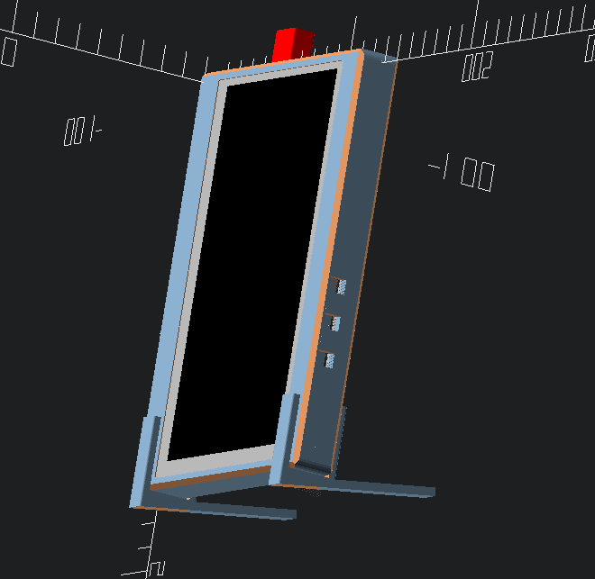

</dd>

<dt id="dir-dt-anker-wireless-charger-holder-thingie-3062864-remix" >

[Anker_Wireless_Charger_Holder-thingie_3062864_remix](Anker_Wireless_Charger_Holder-thingie_3062864_remix/#readme)

</dt><dd>
Anker Wireless Charger Holder-thingie 3062864 remix

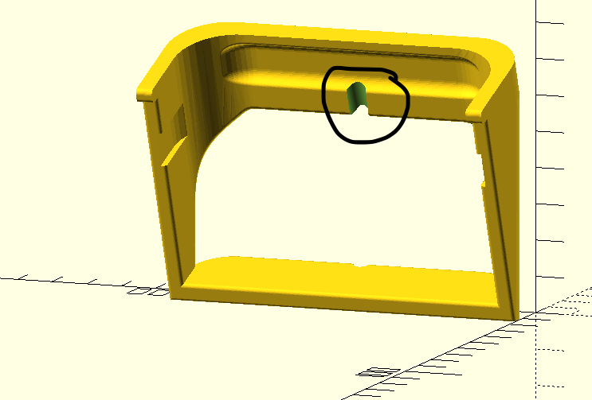

</dd>

<dt id="dir-dt-elp2p8-usb-webcam-mount" >

[ELP2p8_USB_webcam_mount](ELP2p8_USB_webcam_mount/#readme)

</dt><dd>
ELP2p8 USB webcam mount

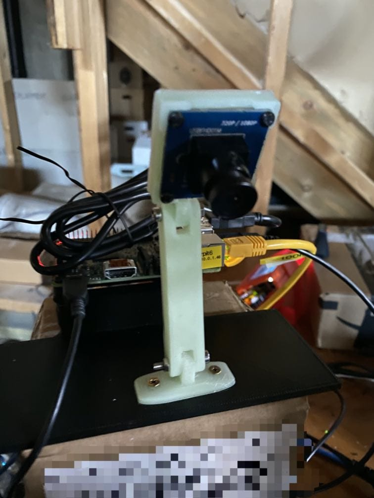

</dd>

<dt id="dir-dt-lulzbot-mini-bed-usb-camera-mount-v2p1-toolhead" >

[LulzBot_Mini_bed_USB_camera_mount_v2p1_toolhead](LulzBot_Mini_bed_USB_camera_mount_v2p1_toolhead/#readme)

</dt><dd>
LulzBot Mini bed USB camera mount v2p1 toolhead

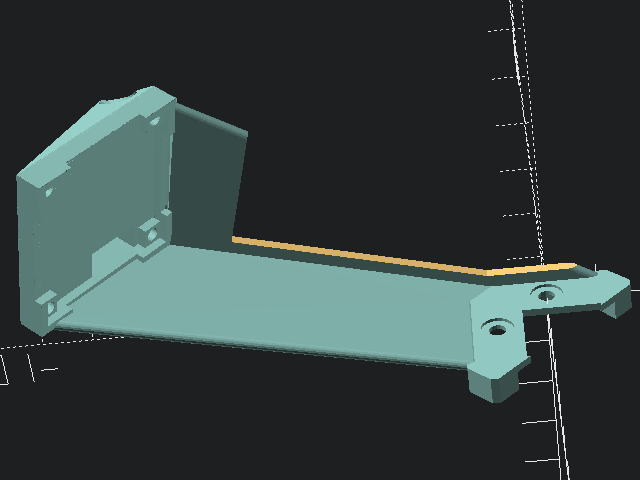

</dd>

<dt id="dir-dt-sd3x5-holder" >

[SD3x5_Holder](SD3x5_Holder/#readme)

</dt><dd>
SD3x5 Holder

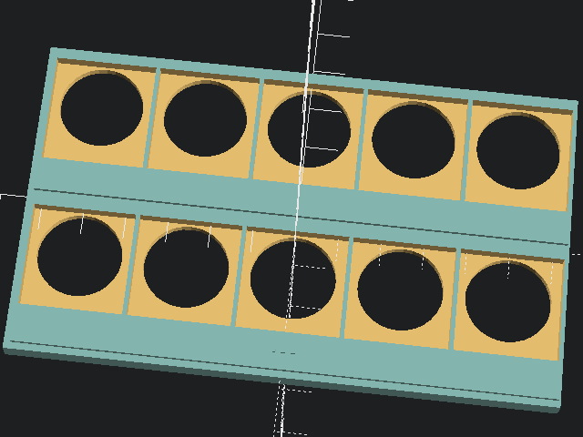

</dd>

<dt id="dir-dt-amazon-echo-auto-alt-dash-mount" >

[amazon_echo_auto_alt_dash_mount](amazon_echo_auto_alt_dash_mount/#readme)

</dt><dd>
amazon echo auto alt dash mount


</dd>

<dt id="dir-dt-another-lulzbot-mini-spool-holder-bushing" >

[another-lulzbot-mini-spool-holder-bushing](another-lulzbot-mini-spool-holder-bushing/#readme)

</dt><dd>
another-lulzbot-mini-spool-holder-bushing

 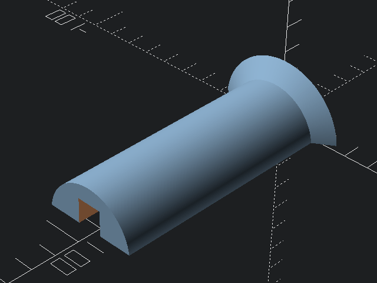

</dd>

<dt id="dir-dt-bone-dog-tag" >

[bone_dog_tag](bone_dog_tag/#readme)

</dt><dd>
bone dog tag

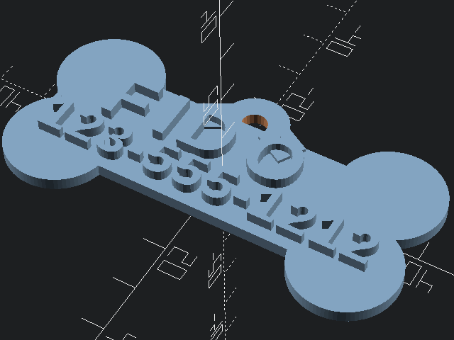

</dd>

<dt id="dir-dt-choetech-wireless-charger-stand-landscape-booster" >

[choetech_wireless_charger_stand_landscape_booster](choetech_wireless_charger_stand_landscape_booster/#readme)

</dt><dd>
choetech wireless charger stand landscape booster


</dd>

<dt id="dir-dt-fireaxe-blade" >

[fireaxe_blade](fireaxe_blade/#readme)

</dt><dd>
fireaxe blade

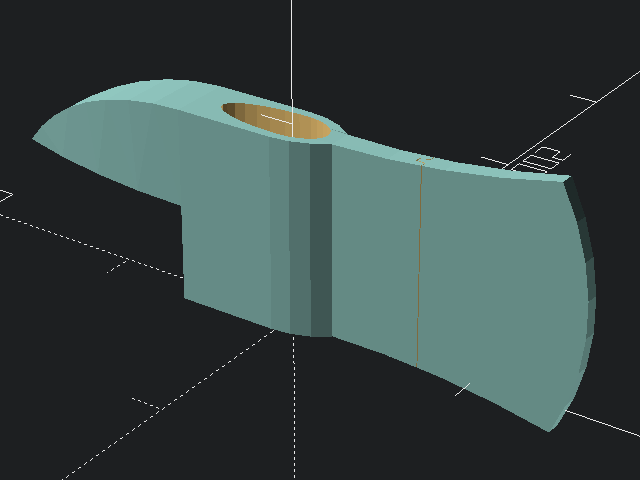

</dd>

<dt id="dir-dt-hanging-shower-caddy-mount" >

[hanging_shower_caddy_mount](hanging_shower_caddy_mount/#readme)

</dt><dd>
hanging shower caddy mount

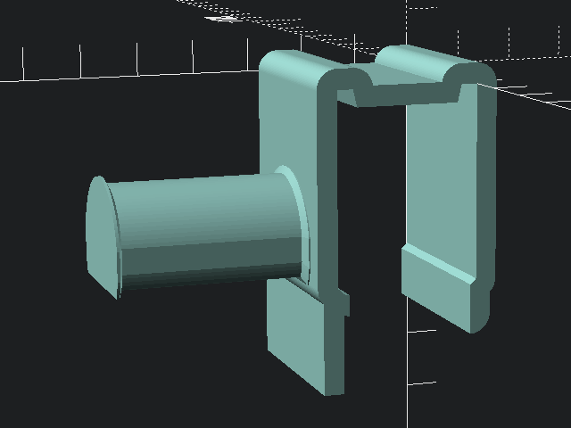

</dd>

<dt id="dir-dt-iphone-11-pro-mockup" >

[iphone_11_pro_mockup](iphone_11_pro_mockup/#readme)

</dt><dd>
iphone 11 pro mockup

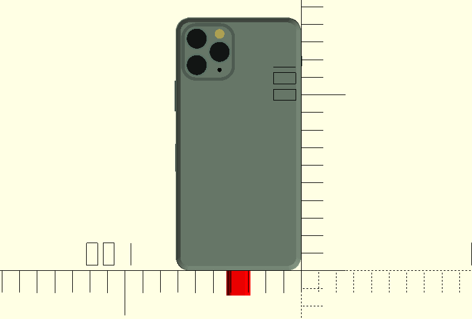

</dd>

<dt id="dir-dt-iphone-11-pro-mount-sleeve" >

[iphone_11_pro_mount_sleeve](iphone_11_pro_mount_sleeve/#readme)

</dt><dd>
iphone 11 pro mount sleeve

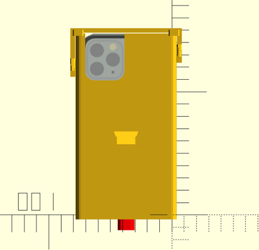

</dd>

<dt id="dir-dt-iphone-11-pro-otterbox-defender-mount-sleeve" >

[iphone_11_pro_otterbox_defender_mount_sleeve](iphone_11_pro_otterbox_defender_mount_sleeve/#readme)

</dt><dd>
iphone 11 pro otterbox defender mount sleeve

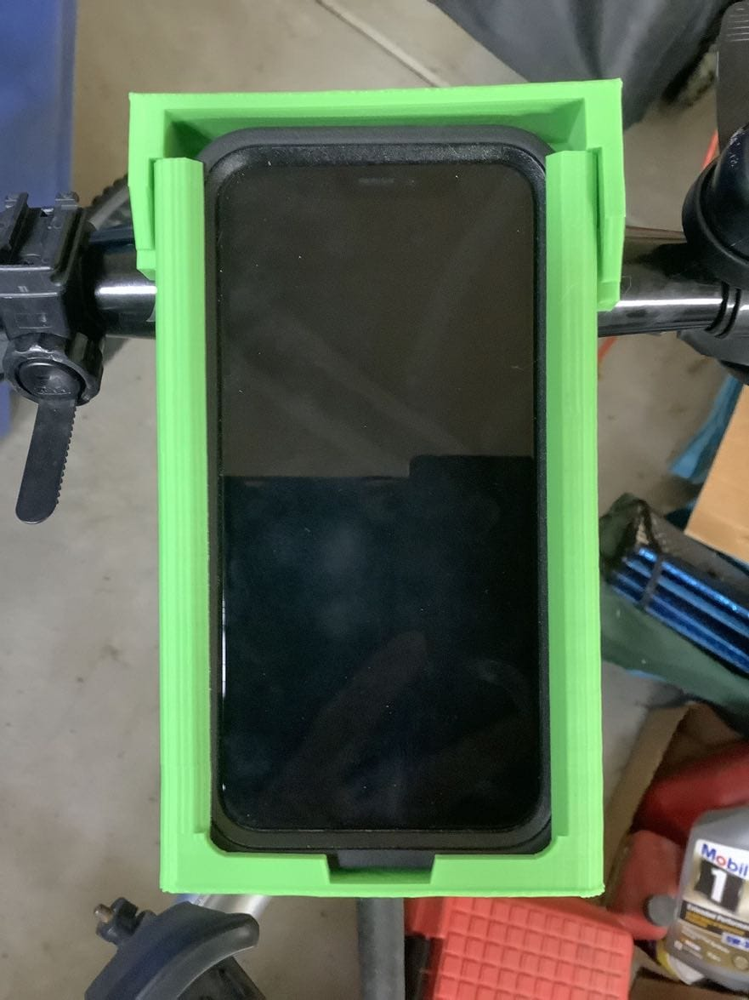

</dd>

<dt id="dir-dt-iphone-6plus-bicycle-mount" >

[iphone_6plus_bicycle_mount](iphone_6plus_bicycle_mount/#readme)

</dt><dd>
iphone 6plus bicycle mount

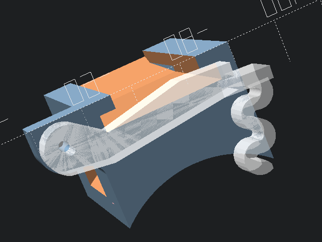

</dd>

<dt id="dir-dt-iphone-6plus-mount-family" >

[iphone_6plus_mount_family](iphone_6plus_mount_family/#readme)

</dt><dd>
iphone 6plus mount family

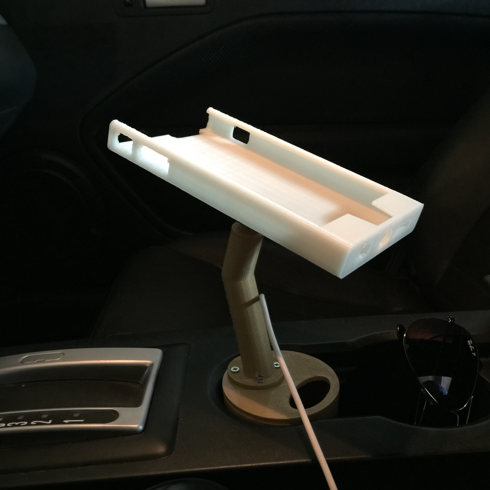

</dd>

<dt id="dir-dt-iphone-8plus-otterbox-statement-case-mount-sleeve" >

[iphone_8plus_otterbox_statement_case_mount_sleeve](iphone_8plus_otterbox_statement_case_mount_sleeve/#readme)

</dt><dd>
iphone 8plus otterbox statement case mount sleeve


</dd>

<dt id="dir-dt-iphone-se-mount-sleeve" >

[iphone_se_mount_sleeve](iphone_se_mount_sleeve/#readme)

</dt><dd>
iphone se mount sleeve

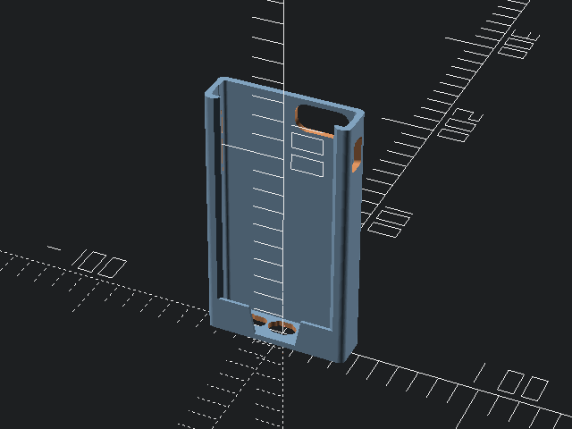

</dd>

<dt id="dir-dt-lsu-tiger-ornament" >

[lsu_tiger_ornament](lsu_tiger_ornament/#readme)

</dt><dd>
lsu tiger ornament

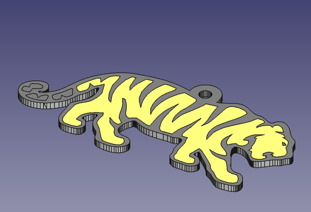

</dd>

<dt id="dir-dt-planter-tray" >

[planter_tray](planter_tray/#readme)

</dt><dd>
planter tray


</dd>

<dt id="dir-dt-raspi-box-fully-enclosed-top-cover" >

[raspi_box_fully_enclosed_top_cover](raspi_box_fully_enclosed_top_cover/#readme)

</dt><dd>
raspi box fully enclosed top cover

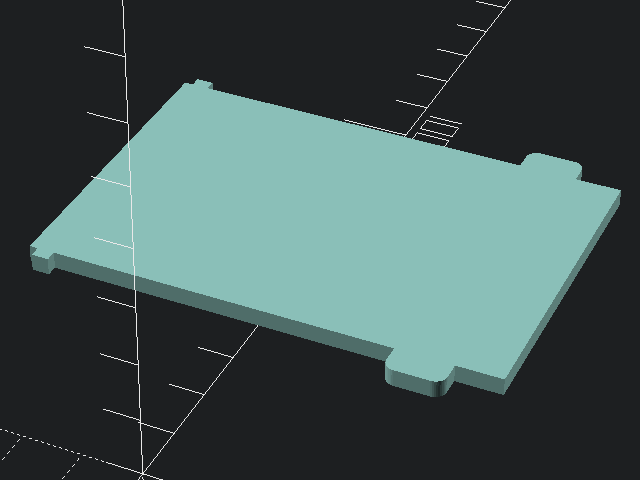

</dd>

<dt id="dir-dt-raspi-cam-hq-models" >

[raspi_cam_hq_models](raspi_cam_hq_models/#readme)

</dt><dd>
raspi cam hq models

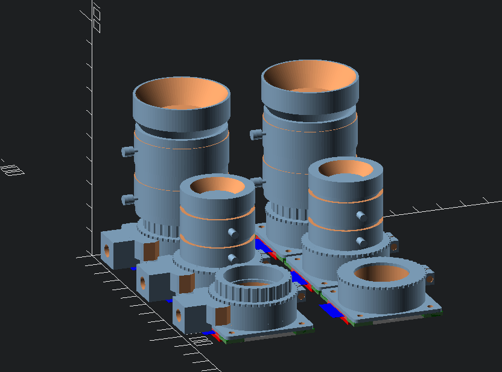

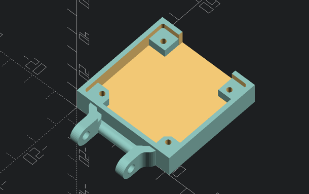

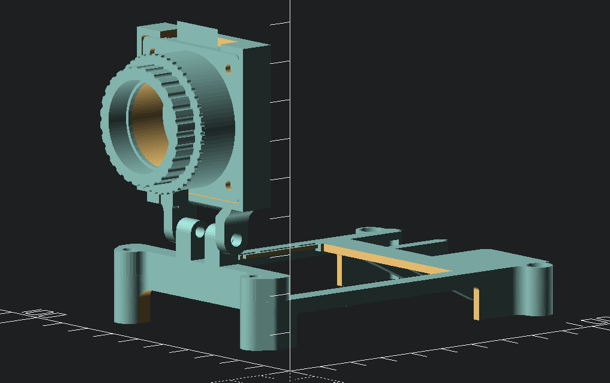

</dd>

<dt id="dir-dt-remix-thing-2160917-octopi-rig-top-ribbon-cable-opening" >

[remix_thing_2160917_octopi_rig_top_ribbon_cable_opening](remix_thing_2160917_octopi_rig_top_ribbon_cable_opening/#readme)

</dt><dd>
remix thing 2160917 octopi rig top ribbon cable opening

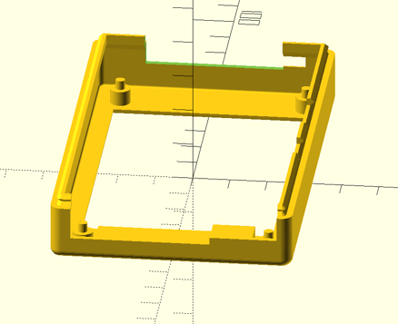

</dd>

<dt id="dir-dt-remix-thing-922740-raspi3-m5-screw-vesa-mount" >

[remix_thing_922740_raspi3_M5_screw_vesa_mount](remix_thing_922740_raspi3_M5_screw_vesa_mount/#readme)

</dt><dd>
remix thing 922740 raspi3 M5 screw vesa mount

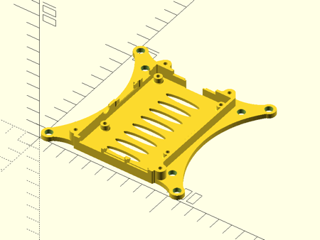

</dd>

<dt id="dir-dt-servo-demo" >

[servo_demo](servo_demo/#readme)

</dt><dd>
servo demo

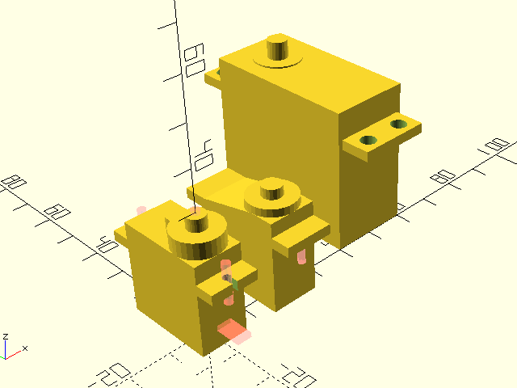

</dd>

<dt id="dir-dt-webcam-small-mount" >

[webcam_small_mount](webcam_small_mount/#readme)

</dt><dd>
webcam small mount

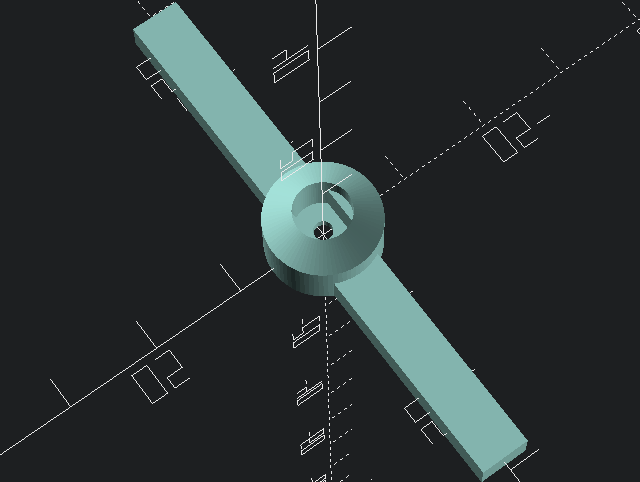

</dd>

<dt>

[x_wing_fighter_laser_cannon](x_wing_fighter_laser_cannon/#readme)

</dt><dd>
x wing fighter laser cannon

 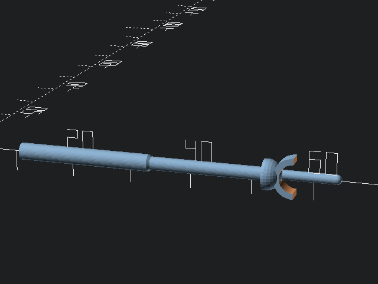

</dd>

</dl>
