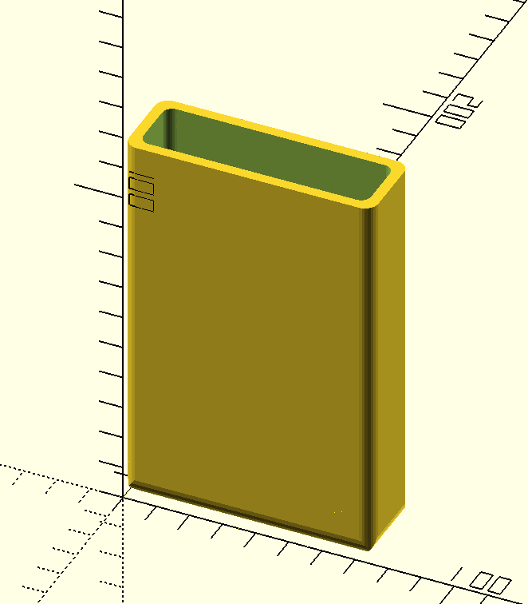
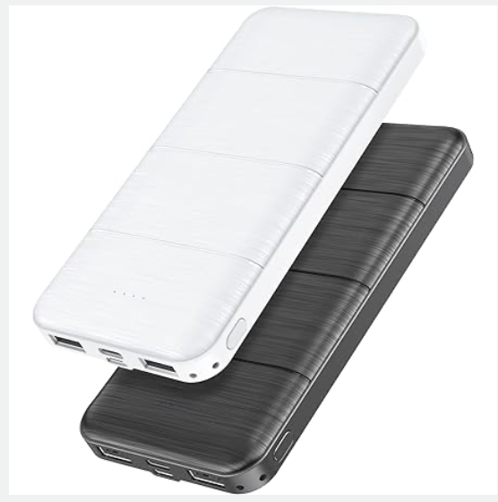
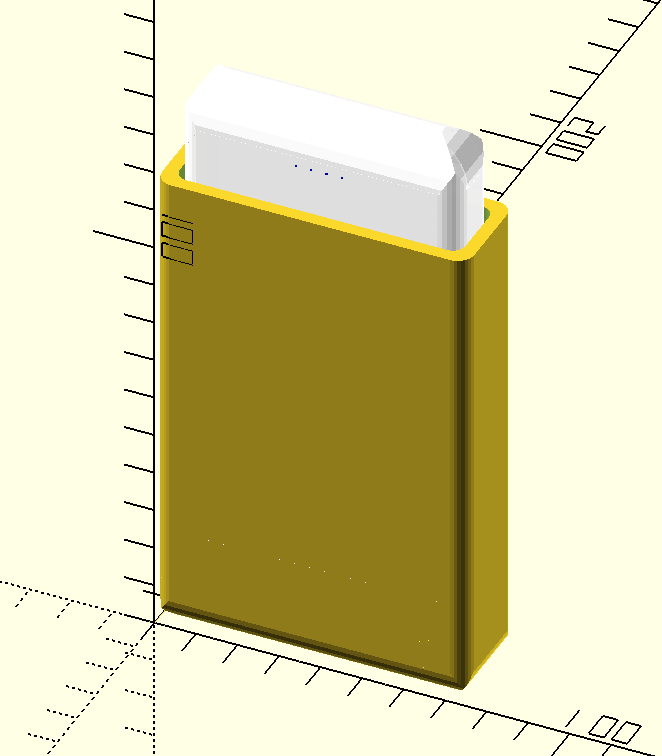

Bike Rack Holder for Powerbank/Charger for Phone
================================================

thingiverse
-----------

Developed for the USB powerbank "LOVELEDI Portable Charger" [Amazon.com: LOVELEDI Portable-Charger-Power-Bank - 2 Pack 15000mAh Dual USB Power Bank Output 5V3.1A Fast Charging Portable Charger Compatible with Smartphones and All USB Devices ](https://www.amazon.com/gp/product/B0B45GX5V7?ie=UTF8&th=1)

-	Capacity: 15000mAh
-	Input(Type-C): 5V/3A(max)
-	Input(Micro): 5V/2A
-	Output(USB-A1): 5V/3.1A
-	Output(USB-A2): 5V/3.1A
-	Size: 5.5 \* 2.5 \* 0.5 in
-	Weight: 203g / 7.1oz
-	Recharge Cycle: >800+times

 product photo

### Related things

Views and Renders
-----------------

Additional parts needed to fully assemble
-----------------------------------------

#### Print

