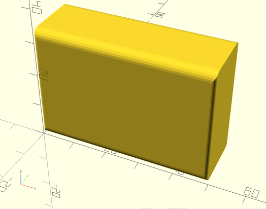
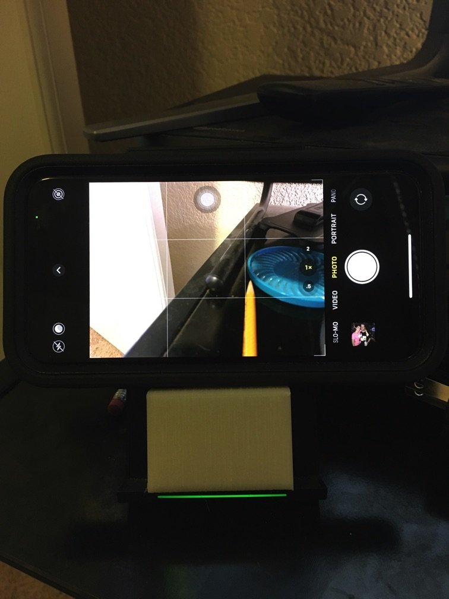
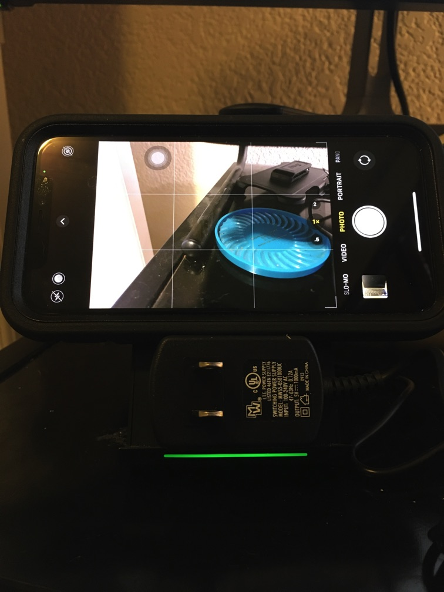

Booster Platform for Choetech Fast Charge Wireless Charger Stand
================================================================

An "accessory" for [Choetech QI Choetech Fast Charge Wireless Charger Stand, Model T520 ](https://www.choetech.com/product/qi-fast-charge-wireless-charger-stand.html)

I found that iPhone in landscape orientation was not activating the wireless charger circuitry. I deduced that this was because the iPhone's inductive coupling coils were not positioned over the charger stands coils. So I designed and printed this simple block, sized to allow an Iphone 11 Pro (in a case) to activate wireless charging in landscape orientation.

1. 3D Printed version

   

1. early "prototype" 😼

   

Published on Thingiverse: 

---

Licensed under [Creative Commons - Attribution - Non-Commercial - Share Alike](https://creativecommons.org/licenses/by-nc-sa/3.0/) license
