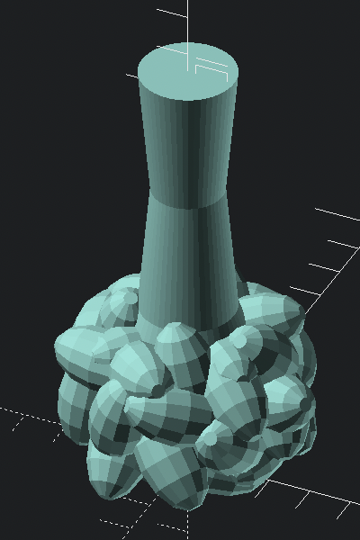

# Coronavirus Spikes

Model of a coronavirus spike for use as a costume prop.

The mortise-and-tenon joint is meant to be compatible among all forms that have it.

## two parts - shortened

The stem in this reduced Z-dimension form is preferred.

[STL shortened spike model - stem](spike_model__stem__shortened.stl)

## two parts - tip

Tip design without shortened Z-dimension.

[STL shortened spike model - tip](spike_model__tip.stl)

### two parts - shortened - not recommended

The tips are closer to pancakes when only Z-dimension is reduced

[STL shortened spike model - tip](spike_model__tip__shortened.stl)

### two parts - stem - not recommended

Stem design before the Z-dimension was shortened. Not recommended unless longer stems are preferred.

[STL shortened spike model - stem](spike_model__stem.stl)

### monolithic - not recommended

[STL for spike model](spike_model.stl)

### Related files

-	`files/Spike.stl`

    - Coronavirus Virion by InsideCorona on Thingiverse: https://www.thingiverse.com/thing:4543692

-	`files/corona_time_2.stl`

	-	easter egg corona virus by Makamaka on Thingiverse: https://www.thingiverse.com/thing:4274662

-	`files/SpikeProtein.stl`

	-	My Take on Corona Virus Covid-2019 Easy Print No Supports (Some Assembly Required) by HAL_9000_HAL_9000 on Thingiverse: https://www.thingiverse.com/thing:4236334
