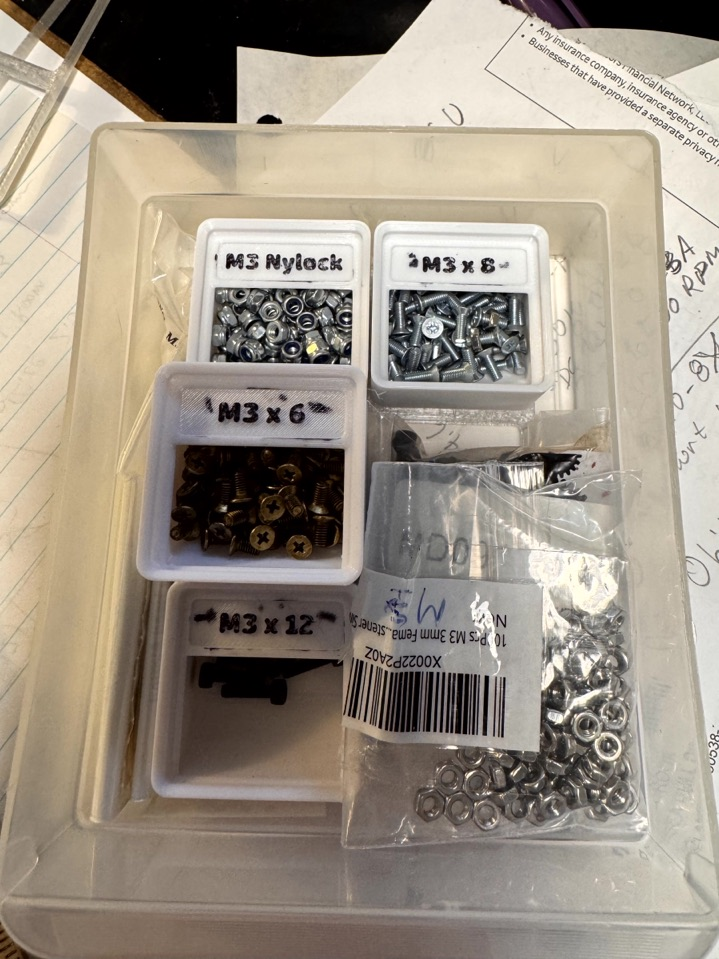
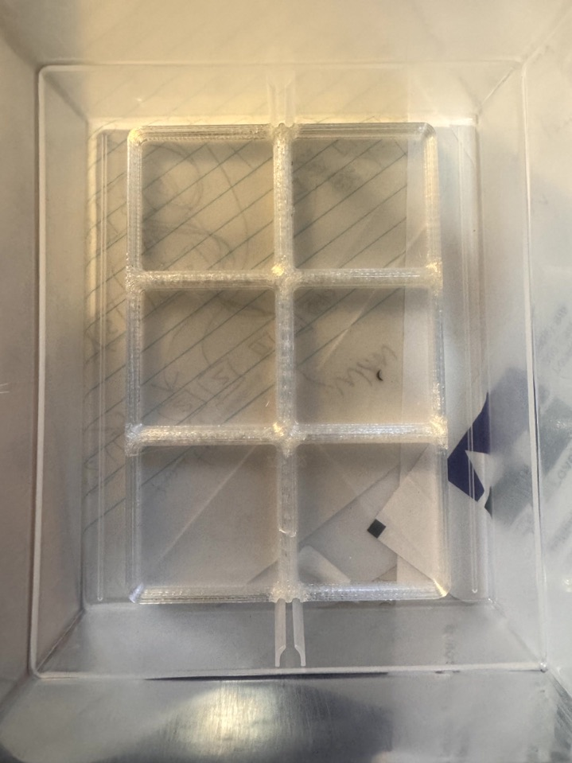

# Akro-Mils 24-Drawer model 10124 box drawer liners for gridfinity

Self-aligning Gridfinity `2 X 3` drawer liners for this  Akro-Mils 10124 model.

In following photo, multiple `3U` height 1x1 gridfinity containers are shown, including some stacked.

Akro-Mils 24-Drawer Plastic Drawer Storage Cabinet -  20" W x 6" D x 16" H, 10124 Black

Product description: HEAVY DUTY CABINET WITH 24 DRAWERS: The 24-drawer small storage cabinet is made in the U.S.A. from rugged, high-impact plastic and measures 20" W x 6" D x 16" H; Organizer drawer external dimensions - 6" x 4-1/2" x 2-3/16"

## Drawer measurements

Product listing: Organizer drawer external dimensions - 6" x 4-1/2" x 2-3/16"

The distance between the two divider **interior** pillars is around `123 mm` or `124 mm`. Designed so that `126 mm` (`42 mm * 3`) `2X3` gridfinity would register at its midpoint, so `1X3` on each side, in middle of drawer.

Can stack two `3U` gridfinity containers (so total `6U`) and fit comfortably in drawer.
