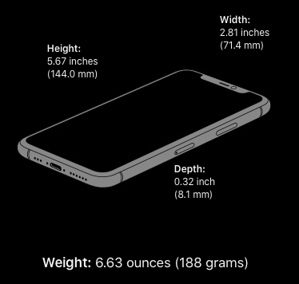
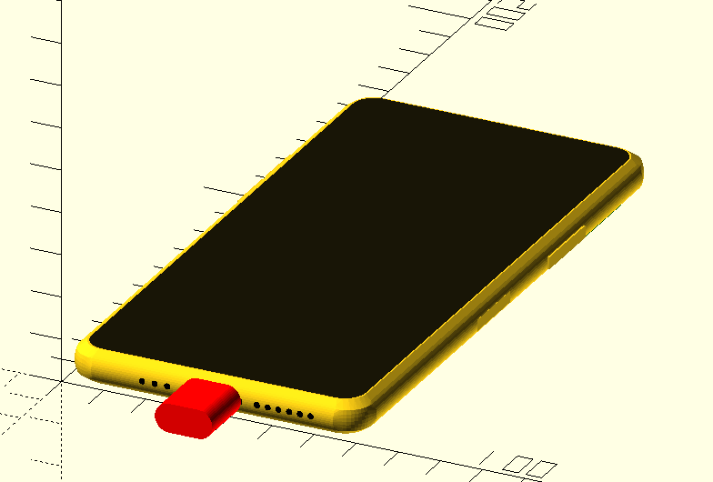

Mechanical dummy model mockup for iPhone 11 Pro
===============================================

Sources
-------

-	Apple's iPhone 11 Pro product page - [Technical Specifications](https://www.apple.com/iphone-11-pro/specs/)

-	Apple's [Accessory Design Guidelines [.pdf]](https://developer.apple.com/accessories/Accessory-Design-Guidelines.pdf) "29. Device Dimensional Drawings" **29.2 iPhone 11 Pro** *(Revision R10, downloaded 2019-Sep-16)*

Gross Dimensions
----------------

Measurements:

-	Height: 5.67 inches (144.0 mm)
-	Width: 2.81 inches (71.4 mm)
-	Depth: 0.32 inch (8.1 mm)

-	Weight: 6.63 ounces (188 grams)

Drawings and renders
--------------------

Thingiverse
-----------

-	[iPhone 11 Pro mockup mechanical dummy model](https://www.thingiverse.com/thing:3865803/)
