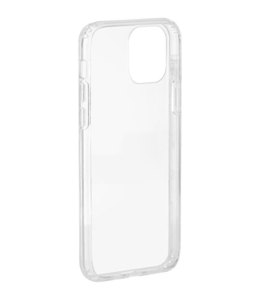

Sleeve for iPhone 11 Pro With Cases
===================================

As part of a family of interchangeable mounts

#### iPhone 11 Pro

https://www.apple.com/iphone-11-pro/specs/

Size and Weight:

-	Height 5.67 inches (144.0 mm)
-	Width 2.81 inches (71.4 mm)
-	Depth 0.32 inches (8.1 mm)
-	Weight 6.63 ounces (188 g)

FORM by Monoprice iPhone 11 Pro 5.8 Rugged Slim Case
----------------------------------------------------

-	[FORM by Monoprice iPhone 11 Pro 5.8 Rugged Slim Case, Clear](https://www.monoprice.com/product?c_id=309&cp_id=30901&cs_id=3090101&p_id=39619)

Case Measurements:

-	Length 147.4 mm
-	Width 74.4 mm (at side buttons)
-	Depth 11.4 mm (at corners)

	-	thinnest 10.6 mm

-	Weight 0.92 oz (26 g)

Views and Renders
-----------------

thingiverse
-----------

-	[iPhone 11 Pro mockup mechanical dummy model](https://www.thingiverse.com/thing:3865803)
-	This model [Modular mount system Sleeve for iPhone 11 Pro with case](https://www.thingiverse.com/thing:3865844)
