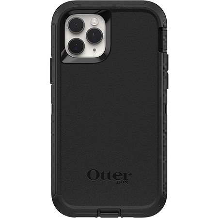
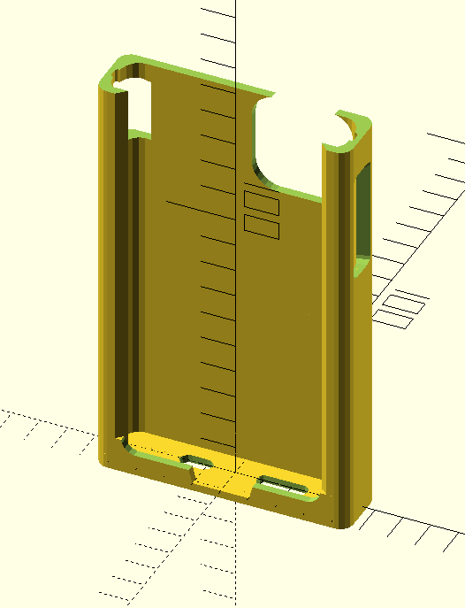
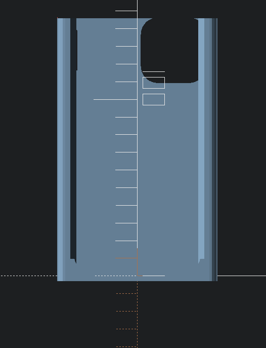
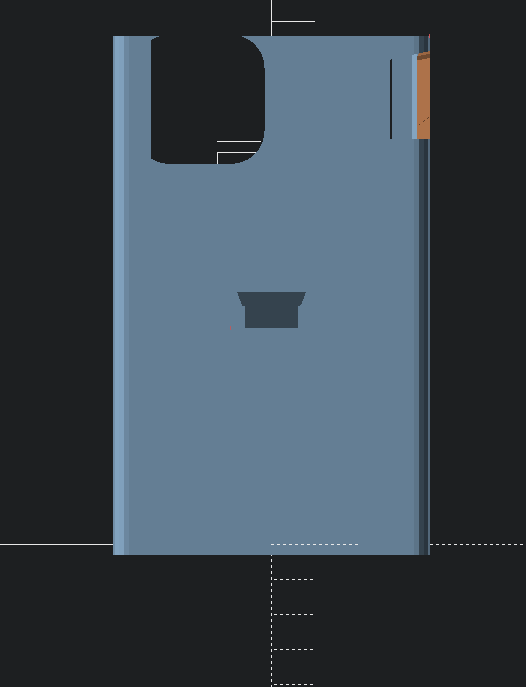
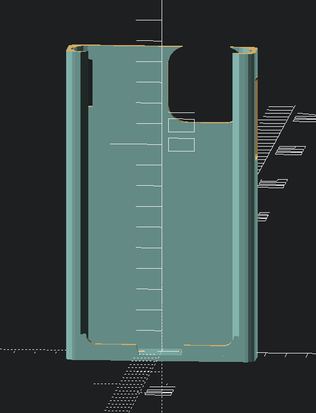
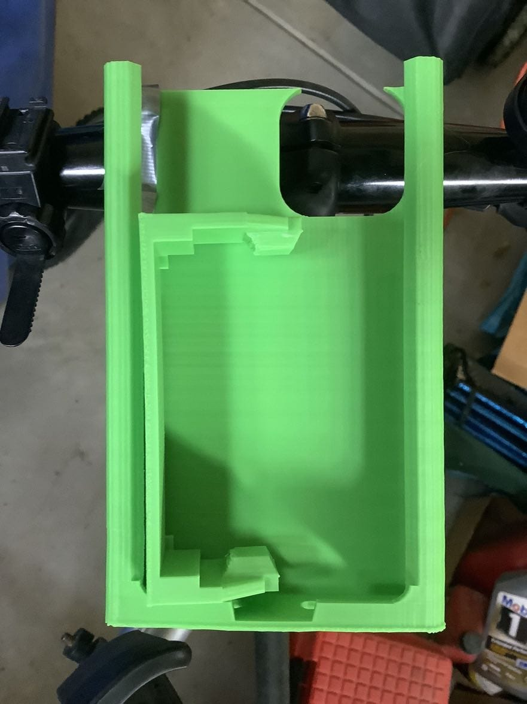
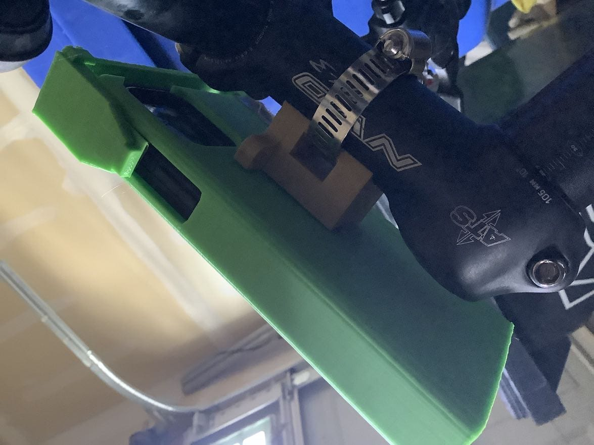

Sleeve for iPhone 11 Pro With Cases
===================================

Part of a family of interchangeable mounts, adapted to iPhone 11 Pro cases

thingiverse
-----------

-	[iPhone 11 Pro mockup mechanical dummy model](https://www.thingiverse.com/thing:3865803)
-	Printable models:
	-	[Modular mount system Sleeve for iPhone 11 Pro with case - Monoprice FORM](https://www.thingiverse.com/thing:3865844)
	-	[Modular mount system Sleeve for iPhone 11 Pro with case - Otterbox Defender](https://www.thingiverse.com/thing:) - This model (not yet published)

iPhone 11 Pro Defender Series Screenless Edition Case
-----------------------------------------------------

-	[iPhone 11 Pro Defender Series Screenless Edition Case](https://www.otterbox.com/en-us/apple-iphone-11-pro/defender-series-screenless-edition-case/77-62521.html)

Case dimensions:

from [FAQ page](https://www.otterbox.com/en-us/apple-iphone-11-pro/defender-series-screenless-edition-case/77-62521.html#tab5): 6.13" x 3.34" x 0.59"

-	Length 155.70 mm
-	Width 84.84 mm
-	Depth 14.99 mm

Measured:

-	l = 155.70 + 0.25; // 155.95 measured
-	w = 84.84; // 83.5 near bottom corners
-	h = 15.75; // measured

Views and Renders
-----------------

#### Prints

##### Installed on bicycle

#### iPhone 11 Pro

https://www.apple.com/iphone-11-pro/specs/

Size and Weight:

-	Height 5.67 inches (144.0 mm)
-	Width 2.81 inches (71.4 mm)
-	Depth 0.32 inches (8.1 mm)
-	Weight 6.63 ounces (188 g)
