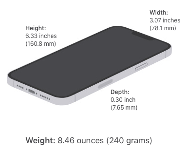
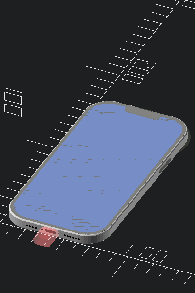
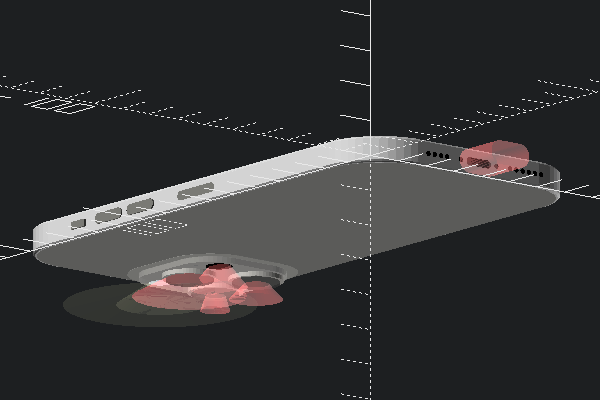
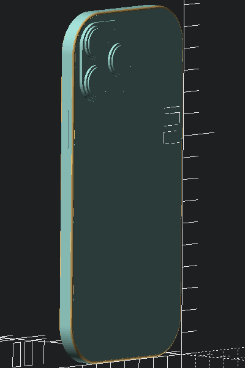
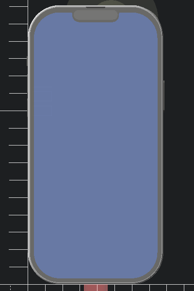
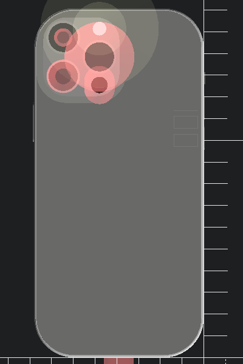

Mechanical dummy model mockup for iPhone 13 Pro Max
===================================================

Summary
-------

Mechanical dummy model mockup for iPhone 13 Pro Max, in OpenSCAD with source code. Very useful for test "fitting" during modeling of cases, mounts etc. Not intended for printing, but it probably could be.

UPDATES
-------

**2021-Oct-16** :

-	Initial revision, started from iPhone 13 Pro model.

Sources
-------

-	Apple's iPhone 13 Pro Max product page - [Technical Specifications](https://www.apple.com/iphone-13-pro/specs/)

-	Apple's [Accessory Design Guidelines [.pdf]](https://developer.apple.com/accessories/Accessory-Design-Guidelines.pdf) "Device Dimensional Drawings" **44.2 iPhone 13 Pro Max 1 of 2** *(Release R15, downloaded 2021-Oct-02)*

Gross Dimensions
----------------

Measurements:

-	Height: 6.33 inches (160.84 mm)
-	Width: 3.07 inches (78.07 mm)
-	Depth: 0.30 inch (7.65 mm)

-	Weight: 8.46 ounces (240 grams)

Drawings and renders
--------------------

Thingiverse
-----------

-	[iPhone 13 Pro Max mockup mechanical dummy model](https://www.thingiverse.com/thing:TBD/)

remix/adaptation from

-	[iPhone 13 Pro mockup mechanical dummy model](https://www.thingiverse.com/thing:4980345/)
-	[iPhone 11 Pro mockup mechanical dummy model](https://www.thingiverse.com/thing:3865803/)
