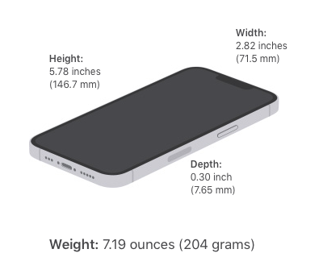
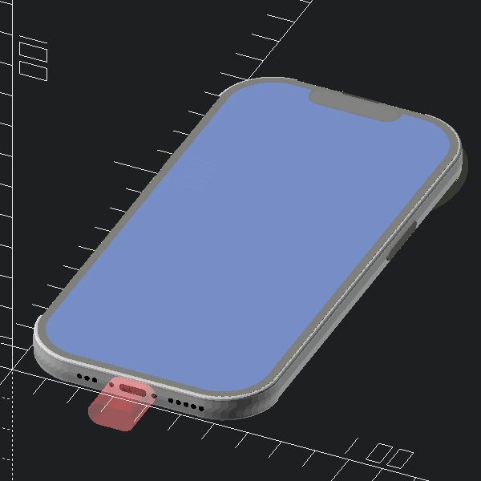

Mechanical dummy model mockup for iPhone 13 Pro
===============================================

Summary
-------

Mechanical dummy model mockup for iPhone 13 Pro, in OpenSCAD with source code. Very useful for test "fitting" during modeling of cases, mounts etc. Not intended for printing, but it probably could be.

UPDATES
-------

**2021-Oct-09** :

-	uploaded version with updated rear cameras, including **keepout cones** for lenses and sensor
-	now also has **stainless steel edge profile** based on engineering drawings.

### Possible tweaks

Details

-	rear camera plateau should be smoothed with a gradient
-	ringer on/off is a switch

Sources
-------

-	Apple's iPhone 13 Pro product page - [Technical Specifications](https://www.apple.com/iphone-13-pro/specs/)

-	Apple's [Accessory Design Guidelines [.pdf]](https://developer.apple.com/accessories/Accessory-Design-Guidelines.pdf) "Device Dimensional Drawings" **44.3 iPhone 13 Pro 1 of 2** *(Release R15, downloaded 2021-Oct-02)*

Gross Dimensions
----------------

Measurements:

-	Height: 5.78 inches (146.71 mm)
-	Width: 2.82 inches (71.54 mm)
-	Depth: 0.30 inch (7.65 mm)

-	Weight: 7.19 ounces (204 grams)

Drawings and renders
--------------------

Thingiverse
-----------

-	[iPhone 13 Pro mockup mechanical dummy model](https://www.thingiverse.com/thing:4980345/)
	-	remix/adaptation from [iPhone 11 Pro mockup mechanical dummy model](https://www.thingiverse.com/thing:3865803/)
