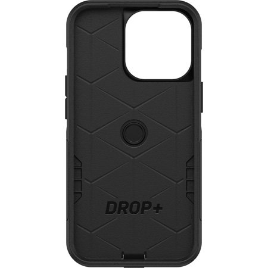
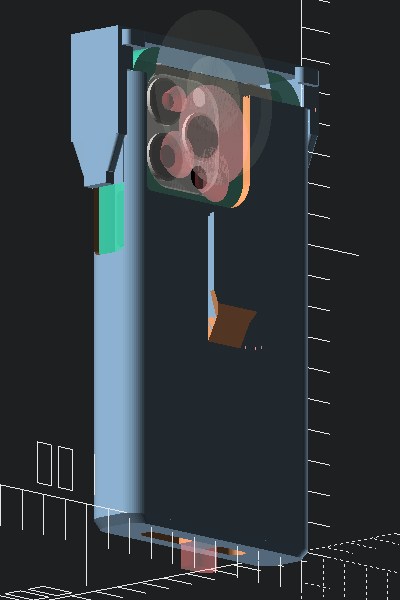
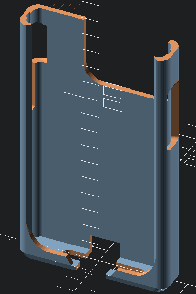
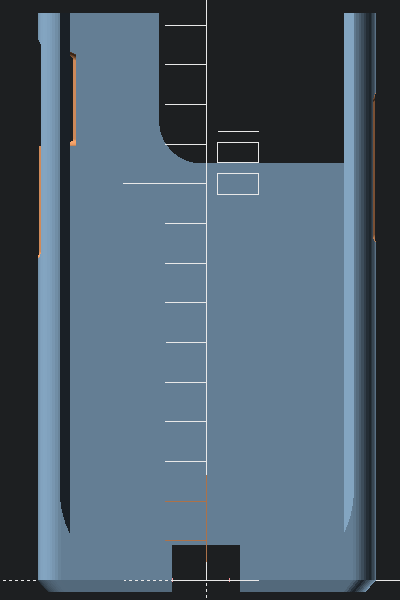
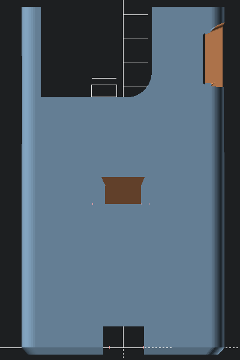
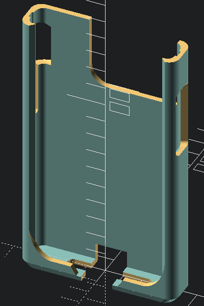
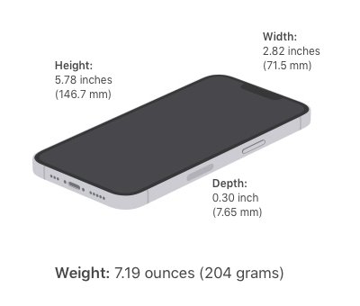

Sleeve for iPhone 13 Pro With Cases
===================================

Part of a family of interchangeable mounts, adapted to iPhone 13 Pro cases

thingiverse
-----------

-	[iPhone 13 Pro mockup mechanical dummy model by dpc - Thingiverse](https://www.thingiverse.com/thing:4980345)
-	Printable models:
	-	[Modular mount system Sleeve for iPhone 13 Pro with case - Otterbox Commuter](https://www.thingiverse.com/thing:TBD) - This model

iPhone 13 Pro Otterbox Commuter Series Case
-------------------------------------------

-	[Protective iPhone 13 Pro Case | OtterBox Commuter Series Case](https://www.otterbox.com/en-us/iphone-13-pro/commuter-series-antimicrobial-case/commuter-iphp21.html)

Case dimensions from [Amazon product page Q&A](https://www.amazon.com/OtterBox-Commuter-Case-iPhone-ONLY/dp/B09D5PFMDR/):

*The Commuter Series Case for iPhone 13 Pro measures 6.03 x 3.12 x 0.56 in | 15.32 x 7.92 x 1.41 cm.*

Views and Renders
-----------------

#### Prints

##### Installed on bicycle

#### iPhone 13 Pro

https://www.apple.com/iphone-13-pro/specs/

Size and Weight:

-	Height: 5.78 inches (146.71 mm)
-	Width: 2.82 inches (71.54 mm)
-	Depth: 0.30 inch (7.65 mm)

-	Weight: 7.19 ounces (204 grams)
