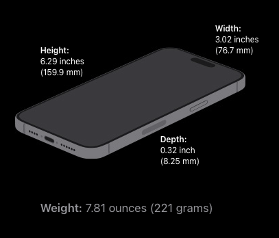
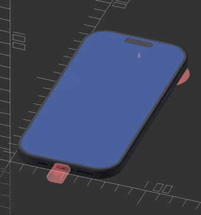
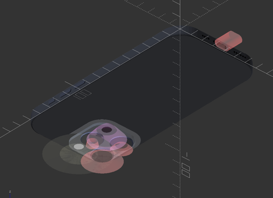
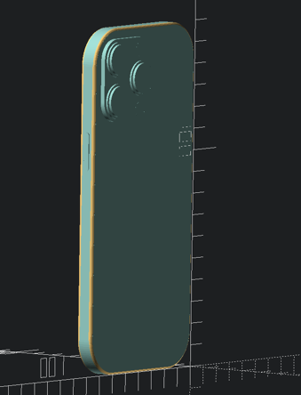
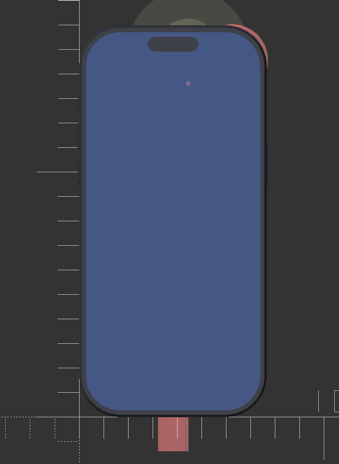
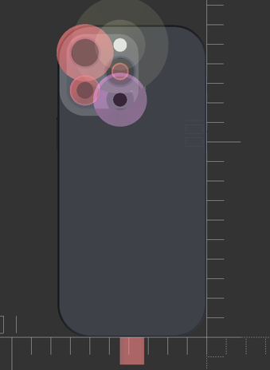

Mechanical dummy model mockup for iPhone 15 Pro Max
===============================================

Summary
-------

Mechanical dummy model mockup for iPhone 15 Pro Max, in OpenSCAD with source code. Very useful for test "fitting" during modeling of cases, mounts etc. Not intended for printing, but it probably could be.

UPDATES
-------

**2023-Oct-31** :

-	update with accessory guidelines dimensions

### Possible tweaks

Details

-	rear camera plateau should be smoothed with a gradient

Sources
-------

-	Apple's iPhone 15 Pro product page - [Technical Specifications](https://www.apple.com/iphone-15-pro/specs/)

-	Apple's [Accessory Design Guidelines [.pdf]](https://developer.apple.com/accessories/Accessory-Design-Guidelines.pdf "Device Dimensional Drawings") **56.1 iPhone 15 Pro Max 1 of 3** *(Release R21, downloaded 2023-Oct-31)*

Gross Dimensions
----------------

Measurements:

-	Height: 6.29 inches (159.9 mm)
-	Width: 3.02 inches (76.7 mm)
-	Depth: 0.32 inch (8.25 mm)

-	Weight: 7.81 ounces (221 grams)

Drawings and renders
--------------------

Thingiverse
-----------

-	[TBD - iPhone 15 Pro Max mockup mechanical dummy model](https://www.thingiverse.com/thing:4980345/)
	-	remix/adaptation from [iPhone 13 Pro mockup mechanical dummy model](https://www.thingiverse.com/thing:4980345/)
