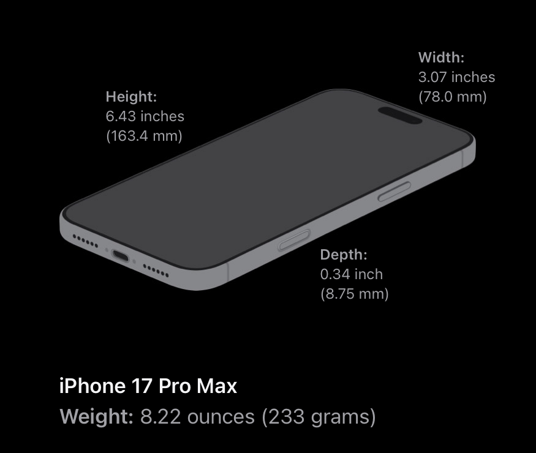

Mechanical dummy model mockup for iPhone 17 Pro Max
===================================================

Summary
-------

Mechanical dummy model mockup for iPhone 17 Pro Max, in OpenSCAD with source code. Useful for test "fitting" during modeling of cases, mounts etc. Not intended for printing, but it probably could be.

UPDATES
-------

**2025-Sep-09** :

-	update solely with accessory guidelines dimensions; still need to adjust eveything else

### Possible tweaks

Details

-	rear camera plateau should be smoothed with a gradient

Sources
-------

-	Apple's iPhone 17 Pro product page - [Technical Specifications](https://www.apple.com/iphone-17-pro/specs/)

-	Apple's [Accessory Design Guidelines [.pdf]](https://developer.apple.com/accessories/Accessory-Design-Guidelines.pdf "Device Dimensional Drawings") **62.1 iPhone 17 Pro Max 1 of 4** *(Release R27, downloaded 2025-Sep-09 )*

Gross Dimensions
----------------

Measurements:

-	Height: 6.43 inches (163.43 mm)
-	Width: 3.07 inches (77.98 mm)
-	Depth: 0.34 inch (8.75 mm)

-	Weight: 8.22 ounces (233 grams)

Drawings and renders
--------------------

<!--  -->

<!--  -->

<!--  -->

<!--  -->

<!--  -->

Model Repositories
------------------

<!-- -	Printables: https://www.printables.com/model/645469-iphone-15-pro-max-mechanical-mockup -->

<!-- -	Thingiverse: [iPhone 15 Pro Max mockup mechanical dummy model](https://www.thingiverse.com/thing:6311478) -->

<!-- 	-	remix/adaptation from [iPhone 13 Pro mockup mechanical dummy model](https://www.thingiverse.com/thing:4980345/) -->
