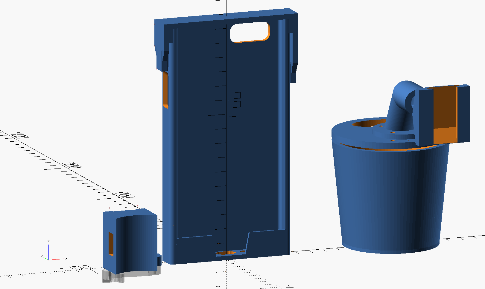
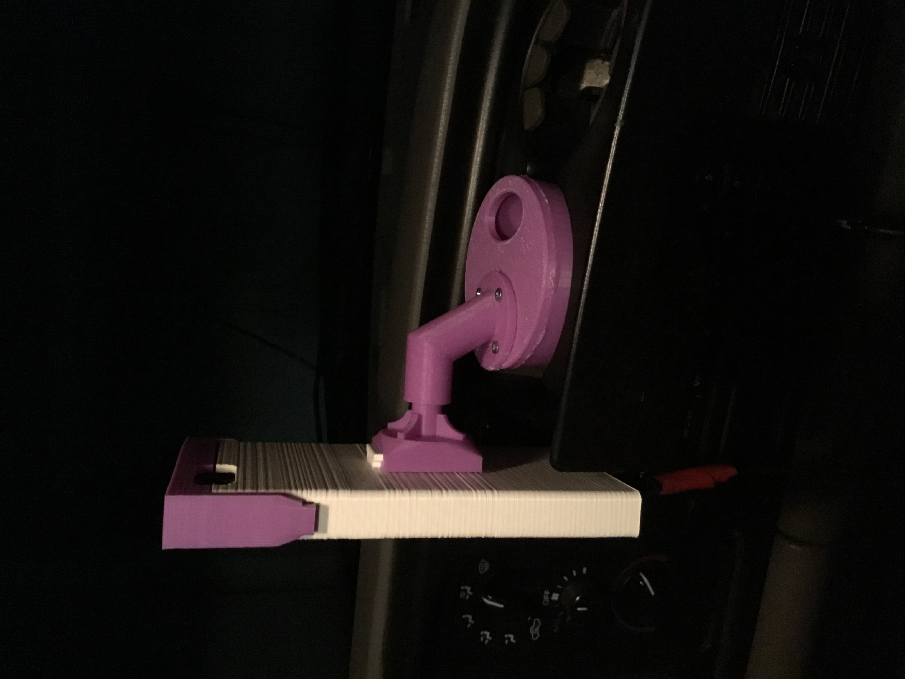
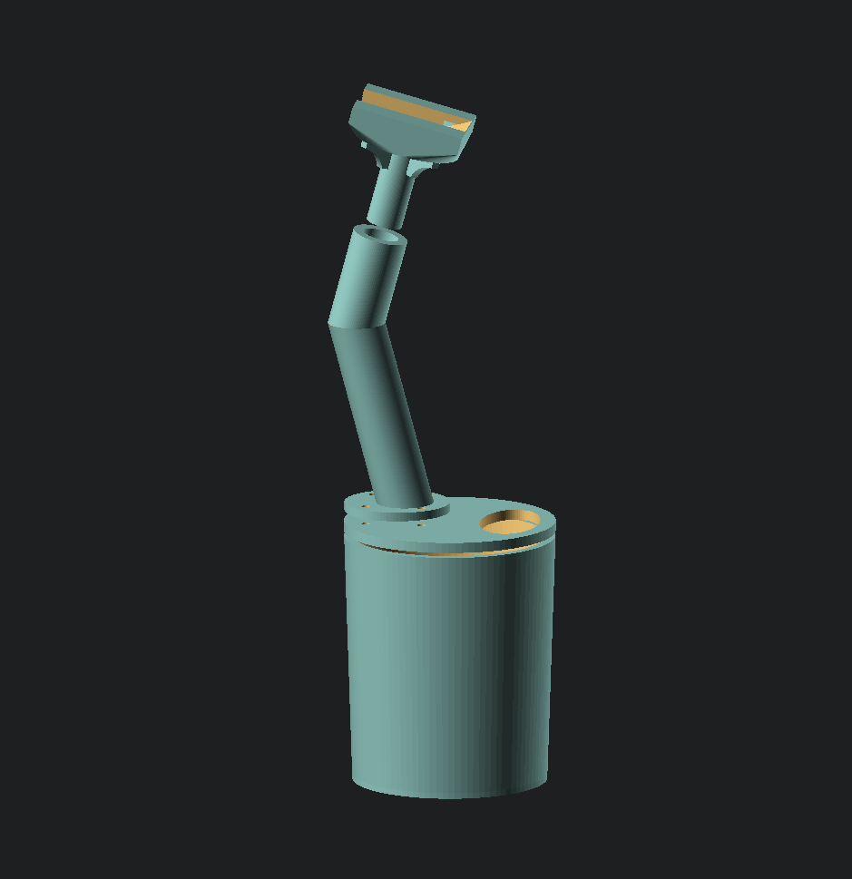

# Bicycle and Car iPhone 6 Plus Mount family

I wanted a case + mount for my iPhone 6 Plus on my bicycle. A lot of the models on Thingiverse are for different cases or caseless iPhone dimensions.  This model was made  to work with the case I use: "Incipio NGP Case for iPhone 6+". 

There is included a bike bracket mount and a couple custom cupholder mount designs, along with the `.SCAD` file used for all of the designs that can be customized.




# TODO

 1. Maybe try to make customizer(s) for Thingiverse

## Reference

  - [iPhone 6 and 6 Plus Mockups](http://www.thingiverse.com/thing:458102)
  - [iPhone Bike Mount](http://www.thingiverse.com/thing:4382)
  - [iphone 6 plus mount for coffee cup holder](http://www.thingiverse.com/thing:783332)

## Files

```
iphone_6plus_mount_family/
├── files
│   ├── iPhone_6_and_6_Plus_Mockups.scad
│   └── mount_v6-catch.stl
│   
├── phone_with_incipio_case.scad
│   
├── sleeve_for_iphone_with_incipio_case.stl
│   
├── sleeve_cap.stl
├── bicycle_mount.stl
├── bicycle_mount_catch.stl
├── sleeve_plus_bicycle_mount.stl
│   
├── cupholder_coupler.stl
├── cupholder_cup.stl
├── cupholder_lid.stl
├── cupholder_lid_bracket.stl
│   
├── cupholder2_cup.stl
├── cupholder2_lid.stl
└── cupholder2_lid_bracket.stl
```

### Cupholder




### Cupholder2




## Methodology

As part of solving this problem, I first used OpenSCAD to model the dimensions on the case.  Then I iterated using experimental prints until I got to sizing and access holes I was satisifed with.


## Thingiverse

[Bicycle and Car iPhone 6 Plus Mount family](http://www.thingiverse.com/thing:1456819) by [dpc](http://www.thingiverse.com/dpc/about) uploaded to thingiverse 

"Remixed" from http://www.thingiverse.com/thing:4382 "iPhone Bike Mount"


