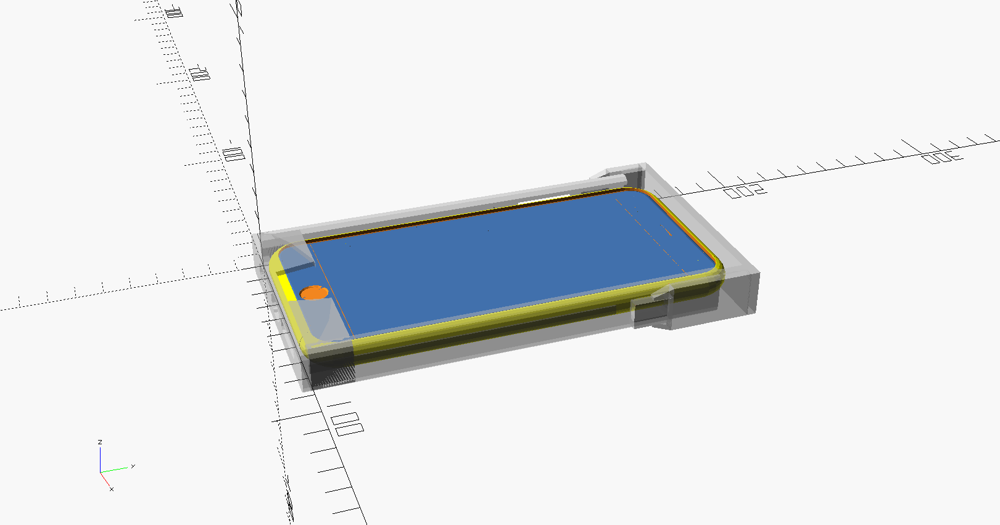

# iPhone 6 Plus Mount family

I wanted a case + mount for my iPhone 6 Plus on my bicycle. A lot of the models on Thingiverse are for different cases or caseless iPhone dimensions.  I made this model to work with the case I use: "Incipio NGP Case for iPhone 6+".

As part of solving this problem, I first used OpenSCAD to model the dimensions on the case.  Then I iterated using experimental prints until I got to sizing and access holes I was satisifed with.

The results are available here.



# TODO

 1. Add mount setting for car and truck vents so I can have similar mounts in
    my autos
 1. Maybe try to make a customizer for Thingiverse

## Reference

  - http://www.thingiverse.com/thing:458102 iPhone 6 and 6 Plus Mockups
  - http://www.thingiverse.com/thing:4382 iPhone Bike Mount
  - http://www.thingiverse.com/thing:18020 Dodge Ram Vent Mount for iPhone

## Files

```
iphone_6plus_mount_family/
├── files
│   ├── iPhone_6_and_6_Plus_Mockups.scad
│   └── mount_v6-catch.stl
├── mount_catch.stl
├── phone_with_incipio_case.scad
├── sleeve_cap.stl
├── sleeve_for_iphone_with_incipio_case.stl
└── sleeve_plus_bicycle_mount.stl
```

## Thingiverse

Uploaded to thingiverse as http://www.thingiverse.com/thing:1456819

"Remixed" from http://www.thingiverse.com/thing:4382 "iPhone Bike Mount"


