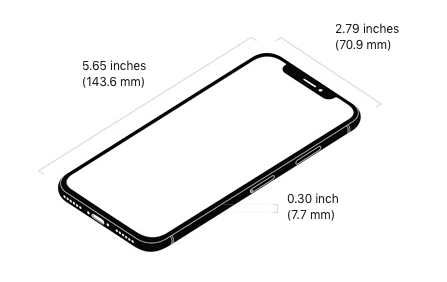

# Mechanical dummy model for iPhone X

Based on latest available information.

## Sources

  - Apple's iPhone X product page - [Technical Specifications](https://www.apple.com/iphone-x/specs/)

  - Apple's [Accessory Design Guidelines [.pdf]](https://developer.apple.com/accessories/Accessory-Design-Guidelines.pdf) "16. Device Dimensional Drawings" _(Revision R3, dated '2017-06-16' not yet updated for iphone X as of 14-Sep-2017)_

## Gross Dimensions

Measurements:

 - Height: 5.65 inches (143.6 mm)
 - Width: 2.79 inches (70.9 mm)
 - Depth: 0.30 inch (7.7 mm)

 - Weight: 6.14 ounces (174 grams)
