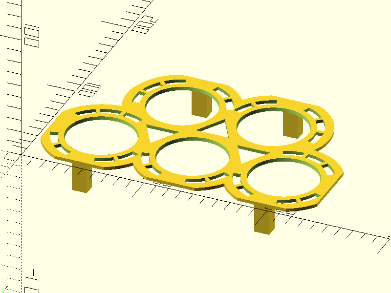

"Palette" with removable wells made for two-ounce plastic cups
===============================================================

Description: For holding small 2 oz. plastic cups, inspired by a similar artist's paint palette design.

Published on Thingiverse: TBD

Asked for by some friends to hold samples from a chili-tasting competition. Intending to hold the two ounze plastic cups that samples are put in.

-	Remix of [Thing files for Artist Palette with removable wells made from milk bottle tops by seagull08 - Thingiverse](https://www.thingiverse.com/thing:4771826/files)

	-	Licensed under [Creative Commons — Attribution 4.0 International — CC BY 4.0](https://creativecommons.org/licenses/by/4.0/)
    -	imported downloaded `EconoPalette.stl` 2021-Aug-22
