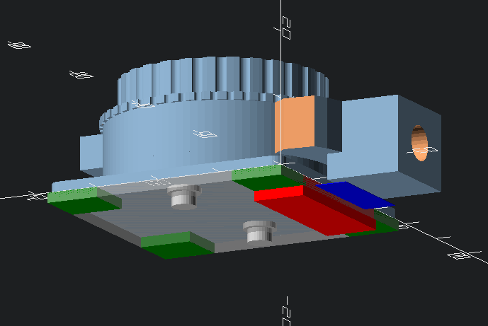

README for Raspberry Pi HQ Camera mount designs
=====================================================

Refer to main README for Raspberry Pi HQ Camera and Lens models

<!-- *Table Of Contents* -->

<!-- markdown-toc start - Don't edit this section. Run M-x markdown-toc-refresh-toc -->
**Table of Contents**

    - [Inspirations or Remix components](#inspirations-or-remix-components)
        - [Raspberry Pi HQ Camera and Lens models](#raspberry-pi-hq-camera-and-lens-models)

<!-- markdown-toc end -->

## Simple mount on PoE hat case modded to be open-chassis

The existing Pi 3B+ PoE case was not dissipating heat well and the fan was kicking in a few times a minute. With this open-chassis design mod, it is much more seldom now.

| Description         | file |
|---------------------|------|
| open-chassis mode   | []     |
| simple HQ cam mount |      |
| mount footer        |      |

## Inspirations or Remix components

| Component         | Original Design                                                                                                        |
| ---               | ---                                                                                                                    |
| Pi case           | [Raspberry Pi 3 Model B+ PoE Case by codebio - Thingiverse](https://www.thingiverse.com/thing:3085529/remixes)         |
| mount footer      | [Raspberry Pi case to camera mount adapter by agmcmll - Thingiverse](https://www.thingiverse.com/thing:3948548)        |
| cam PCB mount     | *camera housing* in [Raspberry Pi Camera Arm by altrome - Thingiverse](https://www.thingiverse.com/thing:547506/files) |
| Vesa tripod mount | [Tripod Adapter to 75mm VESA by agmcmll - Thingiverse](https://www.thingiverse.com/thing:3963789)                      |

### Raspberry Pi HQ Camera and Lens models

shared on **Thingiverse**: [Raspberry Pi HQ Camera Reference Dummy Model](https://www.thingiverse.com/thing:4335497/)

