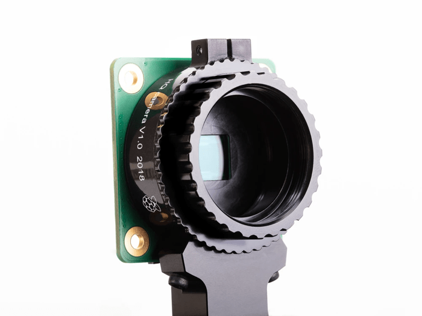
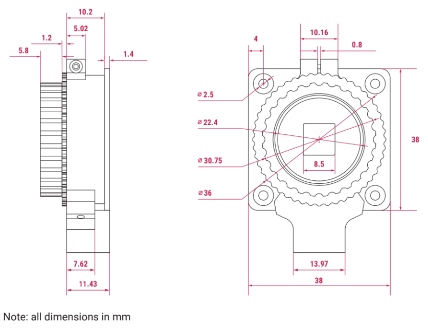
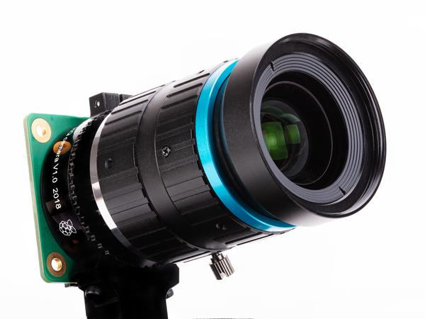
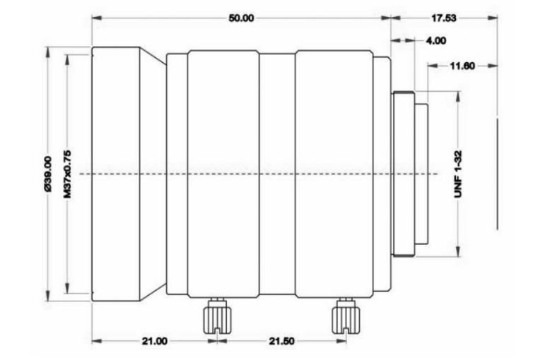

# Models for Raspberry Pi HQ Camera (Released May 2020)

<!-- markdown-toc start - Don't edit this section. Run M-x markdown-toc-refresh-toc -->
**Table of Contents**

- [Raspberry Pi HQ Camera](#raspberry-pi-hq-camera)
    - [Raspberry Pi HQ Camera 6mm Wide Angle Lens](#raspberry-pi-hq-camera-6mm-wide-angle-lens)
        - [TECHNICAL SPECIFICATIONS](#technical-specifications)
    - [Raspberry Pi HQ Camera 16mm Telephoto Lens](#raspberry-pi-hq-camera-16mm-telephoto-lens)
        - [TECHNICAL SPECIFICATIONS](#technical-specifications-1)

<!-- markdown-toc end -->

# Raspberry Pi HQ Camera

 - Chicago Electronic Distributors - [Raspberry Pi HQ Camera](https://chicagodist.com/products/raspberry-pi-hq-camera)
 - Pi Shop - [Raspberry Pi HQ Camera](https://www.pishop.us/product/raspberry-pi-hq-camera/)

## Raspberry Pi HQ Camera 6mm Wide Angle Lens

 - Chicago Electronic Distributors - [Raspberry Pi HQ Camera Wide Angle Lens](https://chicagodist.com/products/raspberry-pi-hq-camera-wide-angle-lens)
 - Pi Shop - [6mm Wide Angle Lens for Raspberry Pi HQ Camera](https://www.pishop.us/product/6mm-wide-angle-lens-for-raspberry-pi-hq-camera/)

 6mm Wide Angle

### TECHNICAL SPECIFICATIONS

| Feature           | Value       |
| ---               | ---         |
| Resolution        | 3 MegaPixel |
| Image format      | 1/2&quot;   |
| Focal Length      | 6mm         |
| Aperture          | f/1.2        |
| Mount             | CS          |
| Field Angle       | 63° DxHxV(°) |
| Back Focal Length | 7.53mm      |
| M.O.D.            | 0.2m        |
| Dimensions        | 30x34mm  |
| Operation         | Manual      |
| Weight            | 53g         |

## Raspberry Pi HQ Camera 16mm Telephoto Lens

 - Chicago Electronic Distributors - [Raspberry Pi HQ Camera Telephoto Lens](https://chicagodist.com/products/raspberry-pi-hq-camera-telephoto-lens)
 - Pi Shop -  [16mm Telephoto Lens for Raspberry Pi HQ Camera](https://www.pishop.us/product/raspberry-pi-hq-camera/)

 16mm Telephoto

### TECHNICAL SPECIFICATIONS

| Feature           | Value            |
| ---               | ---              |
| Resolution        | 10 MegaPixel     |
| Image format      | 1&quot;          |
| Focal Length      | 16mm             |
| Aperture          | f/1.4-f/16       |
| Mount             | C                |
| Field Angle       |                  |
| 1"                | 44.6° × 33.6°    |
| 2/3"              | 30.0° × 23.2°    |
| 1/1.8"            | 24.7° × 18.6°    |
| 1/2"              | 21.8° × 16.4°    |
| Back Focal Length | 17.53mm          |
| Optical Length    | 67.53mm          |
| M.O.D.            | 0.2m             |
| Dimensions        | 39.00 by 50.00mm |
| Operation         | Manual           |
| Weight            | 133.7g           |
