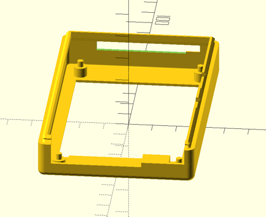

Remix for GPIO ribbon cable opening - Raspberry Pi OctoPi Rig with 3.5" Adafruit Display
========================================================================================

Published on Thingiverse: [Remix for GPIO ribbon cable opening - Raspberry Pi OctoPi Rig with 3.5" Adafruit Display](https://www.thingiverse.com/thing:3985915)

Description: Add an opening for egress of GPIO ribbon cable via the internal 3.5" display GPIO repeated header

<!-- only the slot version is useful -->

<!--  -->

Notes
-----

The ribbon cable for the camera is not really able to freely overlay alongside the GPIO ribbon cable. However, the camera cable can go in the seam between the top and bottom cases and alongside the GPIO cable. It fits approximately between the edge of the GPIO cable and the corner of the case.

Process
-------

Remix a version to take into account GPIO ribbon cable by using OpenSCAD to simply subtract part of the model.

-	Remix of [Octoprint raspberry pi rig remix](https://www.thingiverse.com/thing:2160917)

	-	which was remix of [OctoPrint Raspberry Pi Rig 3.5" PiTFT Touch Display](https://www.thingiverse.com/thing:1601055)

	-	Licensed under [Creative Commons - Attribution - Non-Commercial - Share Alike](https://creativecommons.org/licenses/by-nc-sa/3.0/) license

	-	imported downloaded `pitft35-top_V2.stl` file 2019-Nov-18
